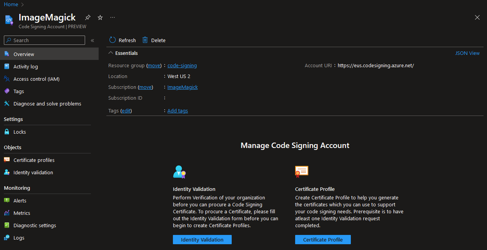
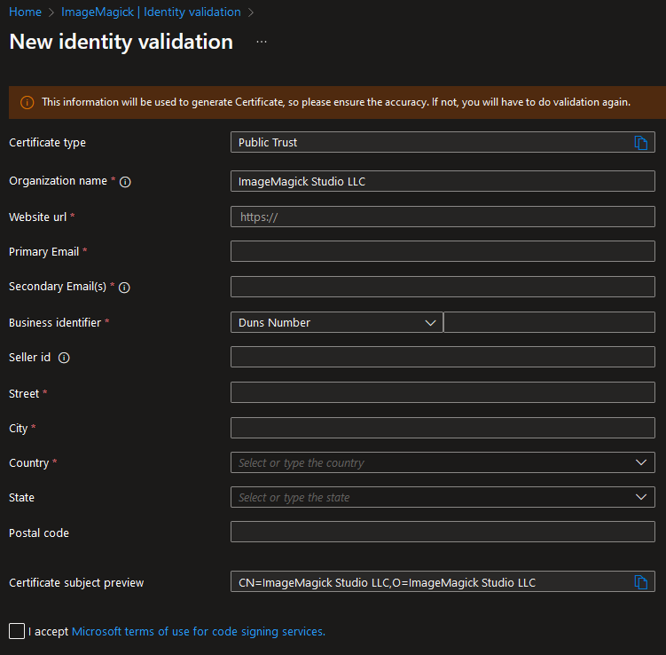
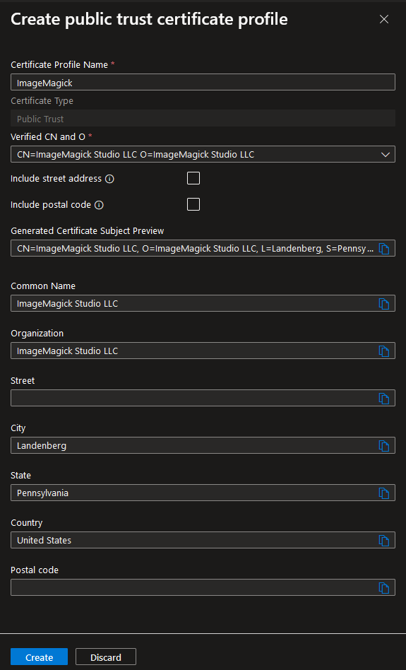
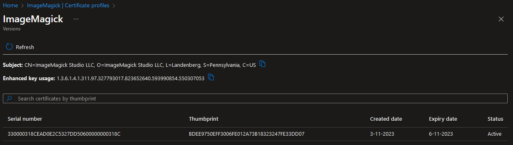
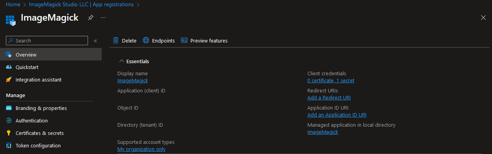
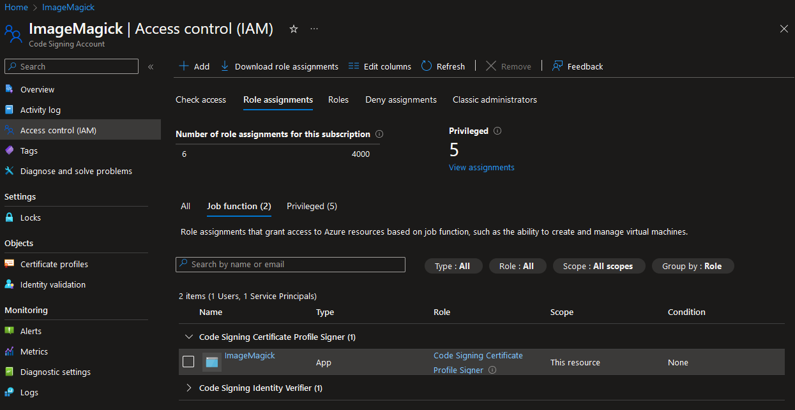
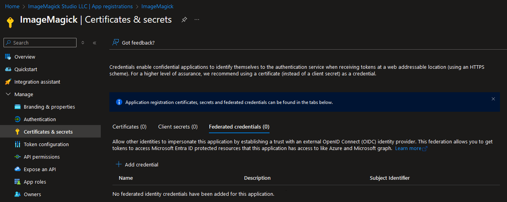
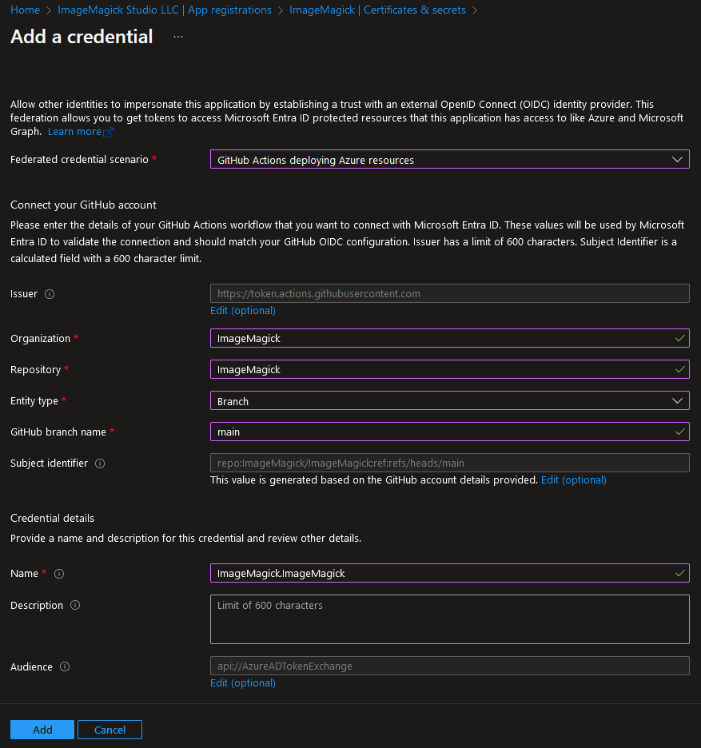
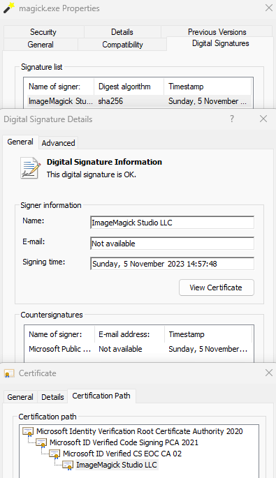

# ImageMagick now uses Azure Code Signing

On the 28th of October of this year the ImageMagick code signing certificate expired. Due to changes in how certificates can be stored our sponsor could no longer support us. In the ImageMagick repository we wrote in this announcement: [https://github.com/ImageMagick/ImageMagick/discussions/6826](https://github.com/ImageMagick/ImageMagick/discussions/6826) that we would no longer sign the Windows executables of ImageMagick. In the responses several options were offered. One of the options was offered by Jaxel Rojas who works on the Azure Code Signing team. They reached out and the next Monday I got a demo about this product. Because we were looking for a cloud based solution this looked like a good solution for us and it turned out it was. This product is still in Preview and subject to change but we are lucky that we can use it to sign our binaries again.

### Create Code Signing Account

The creation of a code signing certificate is done in multiple steps and the first step is to create a Code Signing Account:



This Code Signing Account is used to request and store the code signing certificate. A code signing certificate contains information about the company that wants to sign binaries (e.g. .exe/.dll/.nuget). The information of this company needs to be validated by the organization that is providing the certificate.

### Identity Validation

The identity validation is done by entering the information of the company. The example below is for a company that is based in the United States. ImageMagick Studio LLC was founded in the United States but other countries are also supported and will require different information depending on the country.



Once the request has been submitted an email will be sent to the "Primary Email" that was entered in the form to approve this. When this is approved an automated process will check the information that was entered and within minutes the identity validation will be completed. This is a big difference with the process that is normally done by companies that provide code signing certificates. But of course there are still edge cases where a manual review needs to be done. And in our case a manual review had to be done. In that edge case the process will be completed within several days and that is probably still faster than when it was requested through another company.

### Create certificate profile

When the validation is completed a certificate profile needs to be created:



This profile uses the information that was provided during the identify validation. Including the street address and postal code is optional here and we decided not to include this information in our certificate. After the profile has been created the a code signing certificate will be created:



A big difference with regular code signing certificates is that the expiry date is no longer a year but now it is only valid for three days and every three days a certificate with a new thumbprint will be created. But that means validation can no longer be done with thumbprint. To solve this Microsoft added a value to the "Enhanced key usage" of the certificate that contains a value to identify our organization: `1.3.6.1.4.1.311.97.327793017.823652640.593990854.550307053`. Every code signing certificate that is created will contain the same value. Because the certificate is only valid for three days this means that when someone gains access to the certificate it will be possible to only revoke certificates that were used during the period that person had access to the Azure Code Signing service. 

## How to sign binaries with GitHub actions

The certificate that was created can be used to sign the executables and libraries of our project. Because we are hosting our ImageMagick project on GitHub we will use the `azure/azure-code-signing-action` GitHub action for this but there is also a task available for Azure DevOps. Before we can use the action an app registration should be created in our Microsoft Entra ID.

### Create and authorize app registration.

Inside the Microsoft Entra ID an app registration should be added. A secret should also be added to this app registration that the GitHub action will use to authorize itself:



After the app registration has been created it needs to be assigned to the role "Code Signing Certificate Profile Signer" inside the Access control (IAM) of the Code Signing Account:



The GitHub action can be executed using a client id and secret but a better approach is using a federated credential. The federated credential can be created in the "Certificates & secrets" page of the app registration:



For our GitHub project we set it up with the following options:



### Setup action

With everything setup we now have everything in place to sign our libraries and executables. This only requires adding one step the to GitHub actions workflow:


```yaml
- jobs:
  - windows:
    name: 'Windows'
    runs-on: windows-2022

    # This is required for the federated credential to work
    permissions:
      id-token: write
      contents: read # This is required for a check out of the repository

    steps:

    # Build our binaries...

    - name: 'Azure CLI login with federated credential'
      uses: azure/login@v2
      with:
        client-id: ${{ secrets.AZURE_CLIENT_ID }}
        tenant-id: ${{ secrets.AZURE_TENANT_ID }}
        subscription-id: ${{ secrets.AZURE_SUBSCRIPTION_ID }}

    - name: Sign binaries
      uses: azure/trusted-signing-action@v0.3.18 # Update this to the most recent version
      with:
        endpoint: https://eus.codesigning.azure.net/
        trusted-signing-account-name: ImageMagick
        certificate-profile-name: ImageMagick
        files-folder: 'ImageMagick-Windows\VisualMagick\bin'
        files-folder-filter: dll,exe
        timeout: 600 # We had to increment this because we sign a lot of files at the same time
```


This requires the following secrets to be added to the GitHub repository:
- `AZURE_TENANT_ID` - The id of the tenant that contains the app registration.
- `AZURE_CLIENT_ID` - The client id of the app registration.
- `AZURE_SUBSCRIPTION_ID` - The id of the subscription that contains the app registration.

When we created our Code Signing Account (`trusted-signing-account-name`) and Certificate Profile (`certificate-profile-name`) we used `ImageMagick` as the name for both. The value for `endpoint` depends on the region that was used when creating the Code Signing Account and this is shown on its overview page. This action results in the following signature:



### How is the file signed?

Before we switched to Azure Code Signing our certificate (and its private key) was stored in a GitHub actions secret. With Azure Code Signing we no longer have access to the private key of the certificate so the signing needs to be done inside the Code Signing Account. But instead of sending the whole executable to the Code Signing Account only a calculated hash is send to the api and a signature is returned. Because of this there is no delay when signing the executables due to an upload and this also means that the Azure Code Signing service never has access to the executable or library.

## When can I use this?

Adding this to our GitHub actions workflow and signing our executables only took a couple steps so we think that more people would want to use this. This feature is now in preview so you cannot use this right now but you can reach out to the team at [AzureCodeSigningTAP@microsoft.com](mailto:AzureCodeSigningTAP@microsoft.com) and request them to become part of the preview. Pricing is not known at this moment in time but we asked to make this affordable for an open source project.

</[@dlemstra](https://github.com/dlemstra)>
