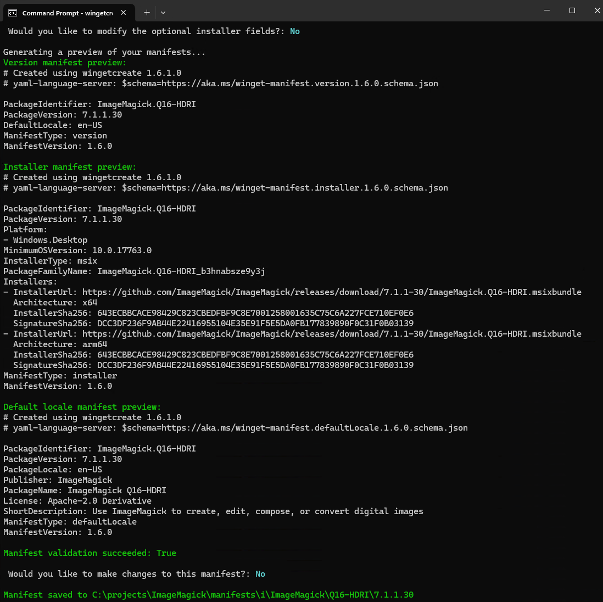

# ImageMagick latest release automatically published to the winget repository

Starting with ImageMagick version `7.1.1-31` we are automatically publishing the latest release to the Windows Package Manager repository. This means you can install ImageMagick using the `winget` command line tool. Because we are using a Trusted Signing certificate the installer will not show a warning when you install it. The installer will also show that it is signed by ImageMagick. And we are now also updating the manifest automatically when we create a new release.

### How is the release created?

The release is created with the help of [Advanced Installer](https://www.advancedinstaller.com/). This program allows the creation of different types of installers and we used it to create a MSIX installer. Inside a GitHub action we build the installer and sign it with a Trusted Signing certificate. And then we publish the installer as an artifact of the GitHub action. More information about how this installer was created and published can be found in the [ImageMagick MSIX installer now uses Trusted Signing](2024/imagemagick-msix-installer-now-uses-trusted-signing) story. 

### How did we create the manifest?

We created the manifest that is required to get the application in the Windows Package Manager repository with artifacts from the following release: [https://github.com/ImageMagick/ImageMagick/releases/tag/7.1.1-30](https://github.com/ImageMagick/ImageMagick/releases/tag/7.1.1-30). The manifest was created with the help of `wingetcreate` that is available in the Windows Package Manager repository. This tool allows the creation of a manifest that can be used to publish a package to the repository. This tool was installed with the following command: `winget install wingetcreate`. To create the manifest we used the following command: `wingetcreate new`. The first question it will ask is the url of the installer:


After we enter the installer url it will download the `.msixbundle` and parse it. And then it allows you to override some of the settings that were parsed from the `.msixbundle`. We used most of the default values. But for some reason it did not recognize the correct `PackageIdentifier` and we had to change that to `ImageMagick.Q16-HDRI`. We also had to change the `License` because it uses the `MIT License` and we use an `Apache-2.0 Derivative` license. And we also used a different `ShortDescription` to make it more clear what our application does.


It will then show a preview of the created manifest in the console.



Because our MSIX bundle contains both an `x64` and `arm64` installer both are shown in the output. Bundling both architectures in a single installer is a great feature of the MSIX format and allows the user to install the correct architecture for their machine with a single installer.

### How was the manifest published?

The `wingetcreate` command will ask if we would want to submit our manifest to the Windows Package Manager repository but because we wanted to add some additional information to the manifest and test it locally first we did not submit it. This might be possible with the `wingetcreate` tool but we found it easier to edit this with a text editor instead.


After we made this changes we made sure our manifest was correct and installed it locally to check if it was working. The validation was done with `winget validate --manifest manifests\i\ImageMagick\Q16-HDRI\7.1.1.30`. And after the successful validation we tried a local installation with `winget install --manifest manifests\i\ImageMagick\Q16-HDRI\7.1.1.30`.


We then created the following pull request to add the manifest to the Windows Package Manager repository: [https://github.com/microsoft/winget-pkgs/pull/148305](https://github.com/microsoft/winget-pkgs/pull/148305) (_Added ImageMagick version 7.1.1-30 that uses an msix installer instead_). This pull request was merged and the manifest was added to the repository.

### How is the manifest updated?

After this pull request was merged we can now update the manifest automatically when we create a new release. We do this with the help of a GitHub action that is triggered when we create a new release. After the release is created we update the manifest with the help of `wingetcreate` in our GitHub actions pipeline:


```yaml
publish_msix:
  name: 'Publish Msix'
  if: startsWith(github.ref, 'refs/tags/')
  needs:
    - version
    - create_release
  runs-on: windows-latest

  steps:
  - name: Install winget
    uses: Cyberboss/install-winget@v1
    with:
      GITHUB_TOKEN: ${{ secrets.GITHUB_TOKEN }}

  - name: Install wingetcreate
    run: winget install wingetcreate --disable-interactivity --accept-source-agreements

  - name: Update manifest on winget
    run: wingetcreate update --submit --replace --token ${{ secrets.WINGET_TOKEN }} --urls https://github.com/ImageMagick/ImageMagick/releases/download/${{ needs.version.outputs.release }}/ImageMagick.Q16-HDRI.msixbundle --version ${{ needs.version.outputs.version }} ImageMagick.Q16-HDRI
```


This action will install `wingetcreate` and then update the manifest with the new release. This is done with the following options:
- `--submit` Submit the manifest to the Windows Package Manager repository through a pull request.
- `--replace` Replace the existing manifest because we only want to have one manifest for the latest release.
- `--token` Used to create a pull request in the Windows Package Manager repository.
- `--urls` Specifies the url of the new installer that was created in the release.
- `--version` Specifies the new version of ImageMagick.

 And the last argument is the `PackageIdentifier` that is used to specify which manifest should be updated. This is the same as the `PackageIdentifier` that was used when the manifest was created. You might also noticed that we use the `GITHUB_TOKEN` to install `winget`. When this story was written the `winget` tool was not yet available in the GitHub actions runners by default. But we hope this will change in the future. And here you can see the pull request that was created this weekend to update the manifest for the latest release: [https://github.com/microsoft/winget-pkgs/pull/155169](https://github.com/microsoft/winget-pkgs/pull/155169) (_New version: ImageMagick.Q16-HDRI version 7.1.1.33_).

### Changes to our federated credentials

When running this workflow we noticed that our federated credential was not working because we publish the release through a tag instead of a commit in the `main` branch. So we decided to add another federated credential for tags. We first tried this with a wildcard (`7*`) for the tag but that did not work. So we changed this to `7.1.1-33` and that worked. But that would mean we would need to update this every release. So we decided to use an environment instead. We added an environment called `release` to our repository with a filter for specific tags:


And used this environment in our federated credential:


With this setup we can now publish a release with an action that is trigger by a tag and the federated credential will work.

### How can I install ImageMagick with winget?

You can install ImageMagick with the following command: `winget install ImageMagick.Q16-HDRI`. In the future we will also add `Q16` and `Q8` builds to the repository and keep them up to date with the same GitHub action that we use for the `Q16-HDRI` build.

</[@dlemstra](https://github.com/dlemstra)>