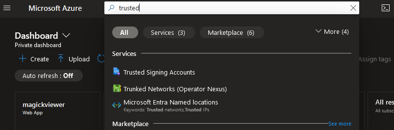
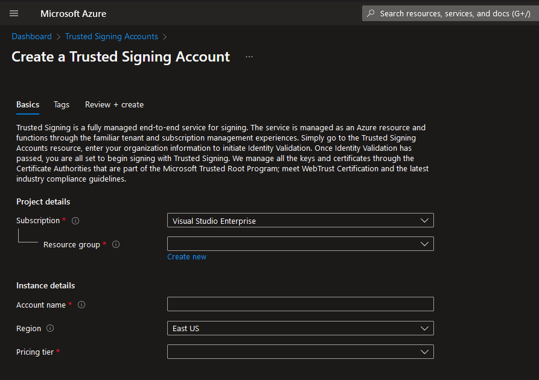
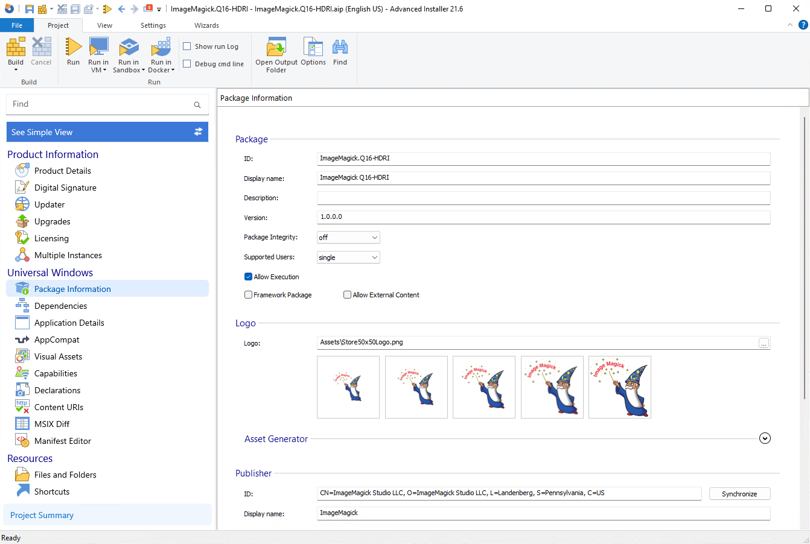
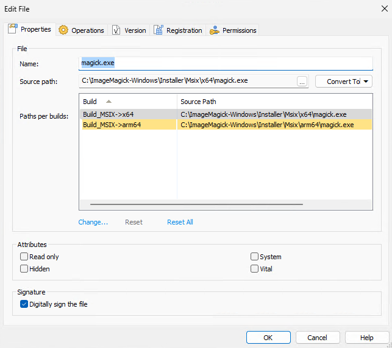
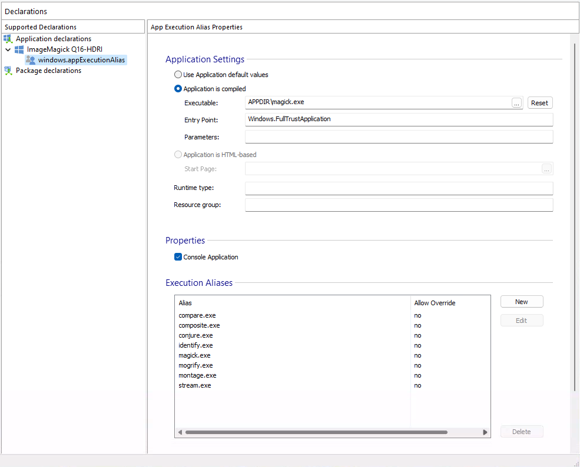
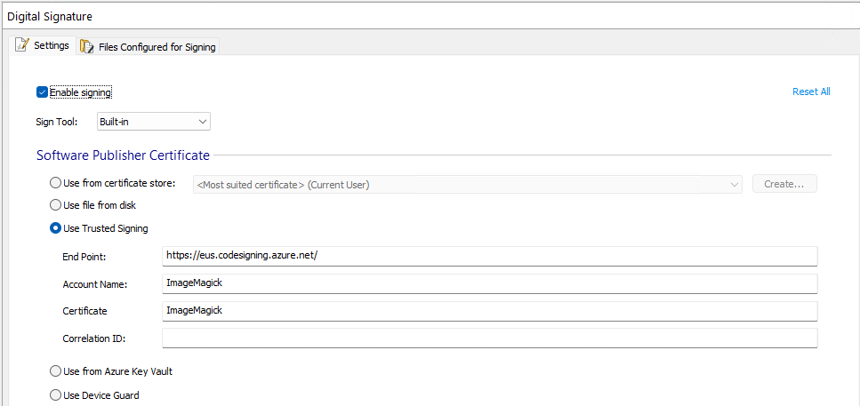
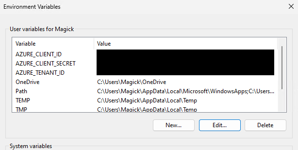

# ImageMagick MSIX installer now uses Trusted Signing

In the previous post we discussed how [ImageMagick now uses Azure Code Signing](https://dlemstra.github.io/github-stories/2023/imagemagick-now-uses-azure-code-signing/) to sign the binaries and you might be wondering why the ImageMagick team is suddenly using a new product called Trusted Signing. The reason for this is that Azure Code Signing is now called [Trusted Signing](https://learn.microsoft.com/en-us/azure/trusted-signing/). The configuration inside Azure has not changed and we are still using the same certificate profile to sign the binaries and the installer. The only thing that has changed is the name of the product. This change was made right before the Public Preview of this product. We are now using this together with [Advanced Installer](https://www.advancedinstaller.com/) to sign the new MSIX installer of [ImageMagick](https://imagemagick.org).

### How can I use Trusted Signing?

Earlier this week Trusted Signing became available in Public Preview. This means you can now find it in the [Azure Portal](https://portal.azure.com/). When you open the portal you can search for "trusted" and from there go to the Trusted Signing Accounts page.



On that page you can create a new account and start using Trusted Signing:



You can find more information on how to set up Trusted Signing in my previous post: [ImageMagick now uses Azure Code Signing](https://dlemstra.github.io/github-stories/2023/imagemagick-now-uses-azure-code-signing/).

### Why is there a new MSIX installer?

We created a new MISX installer to make it easier to install ImageMagick on your Windows machine. The new installer is build the same way as our portable releases and that means it will not use the Windows registry. And using an MSIX will also make it possible to publish the installer in the Microsoft Store in the future. For now we have only published it on [WinGet](https://github.com/microsoft/winget-cli). This will allow a user to install ImageMagick with a single command: `winget install ImageMagick.Q16-HDRI`. Another story will be created to explain how we published the installer on WinGet in the future.

### How did we create the MSIX installer.

The installer was created with the help of [Advanced Installer](https://www.advancedinstaller.com/). This program allows the creation of different types of installers and we used it to create a MSIX installer. The installer uses a configuration file and an example of that project file can be found here: [https://github.com/ImageMagick/ImageMagick-Windows/blob/main/Installer/Msix/ImageMagick.Q16-HDRI.aip](https://github.com/ImageMagick/ImageMagick-Windows/blob/main/Installer/Msix/ImageMagick.Q16-HDRI.aip). The configuration of our installer was very easy with this application and we only needed to configure a few things to create the installer.



Advanced Installer also allows us to create an `.msixbundle` that contains the binaries of both the `x64` and the `arm64` build of the project. This means that the installer will automatically install the correct architecture for the user. We did not include an `x86` build because most users will no longer need this.



Another great option is that we only need to bundle `magick.exe` in the installer. The installer will automatically create the other aliases that are available in the portable release. This means that the installer will also create the `identify.exe`, `mogrify.exe`, etc. Our `magick.exe` file checks on startup what the name of the application is and chooses a different flow depending on the name of the program. Having only one executable really reduces the size of the installer and the size of the files that need to be installed on the machine of the user.



### How is the MSIX installer signed?

The signing is integrated in Advanced Installer and can be configured through their GUI. With the "Use Trusted signing" option we sign the installer with a Trusted Signing certificate. This means that the installer will not show a warning when the user tries to install it. And the installer will also show that it is signed by ImageMagick.



Because Trusted Signing is used we also need to set some environment variables to make sure we can build the installer. The `AZURE_CLIENT_ID`, `AZURE_TENANT_ID` and `AZURE_CLIENT_SECRET` environment variables are used by `signtool` that is used to sign the installer and the `.dll` and `.exe` files that are included in the installer.



### How is this integrated in the CI of ImageMagick?

The company behind Advanced Installer has also created a GitHub action that can be used to build the installer. This action can be found here: [https://github.com/Caphyon/advinst-github-action](https://github.com/Caphyon/advinst-github-action). In the CI of ImageMagick we use this action to build the installer. The following example shows how we use this action:


```yaml

- jobs:
  - windows:
    name: 'Windows'
    runs-on: windows-latest

    # This is required for the federated credential to work
    permissions:
      id-token: write
      contents: read # This is required for a check out of the repository

    steps:

    # Build our binaries...

    - name: 'Azure CLI login with federated credential'
      uses: azure/login@v2
      with:
        client-id: ${{ secrets.AZURE_CLIENT_ID }}
        tenant-id: ${{ secrets.AZURE_TENANT_ID }}
        subscription-id: ${{ secrets.AZURE_SUBSCRIPTION_ID }}

    - name: Create msixbundle with Advanced Installer
      if: github.event_name != 'pull_request'
      uses: caphyon/advinst-github-action@v2.0
      with:
        advinst-license: ${{ secrets.ADVINST_LICENSE_KEY }}
        aip-path: ImageMagick-Windows\Installer\Msix\ImageMagick.Q16-HDRI.aip
        aip-build-name: Build_MSIX
        aip-commands: |
            SetVersion ${{ needs.version.outputs.version }}
```


This action will build the installer and sign it with the certificate that is configured in the Advanced Installer project file. The installer will then be uploaded to the GitHub release page of ImageMagick. The advantage of this setup is that we only need to configure the Advanced Installer action and don't need a separate action to sign the installer and the `.dll` and `.exe` files that are included in the installer. In the example above we are using federated credentials and you can find more information on how to set this up in my previous post: [ImageMagick now uses Azure Code Signing](https://dlemstra.github.io/github-stories/2023/imagemagick-now-uses-azure-code-signing/).

### Where can I download the MSIX installer?

The new installer can be found on the GitHub releases page of ImageMagick. You can find the latest release here: [https://github.com/ImageMagick/ImageMagick/releases](https://github.com/ImageMagick/ImageMagick/releases). For now we only support a `Q16-HDRI` build but we will be going to add a `Q16` and `Q8` build in the future. 

### Will the MSIX installer replace the other installer?

We will not replace the other installer because that installer contains featurs that are not available in the MSIX installer. The old installer uses the Windows registry and that is needed for some applications that use ImageMagick. But we might switch from InnoSetup to Advanced Installer in the future.

</[@dlemstra](https://github.com/dlemstra)>
