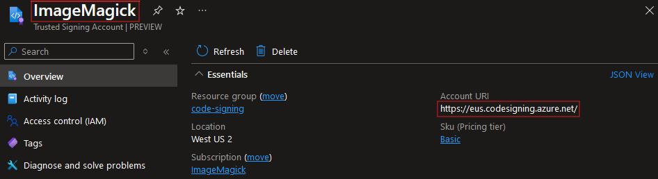
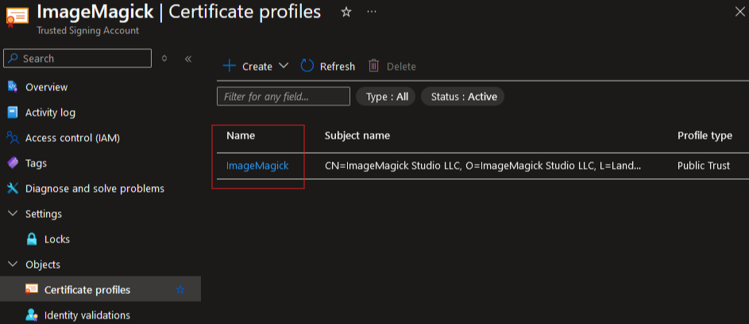
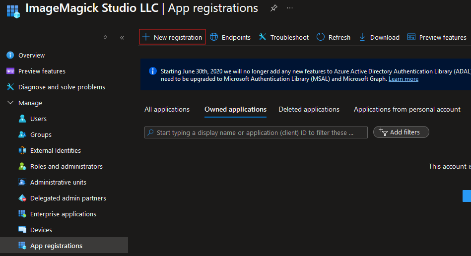
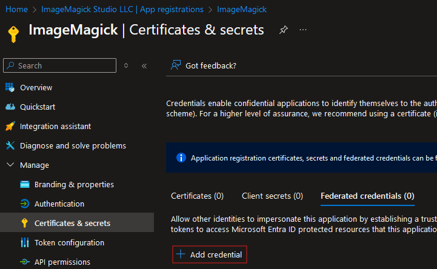
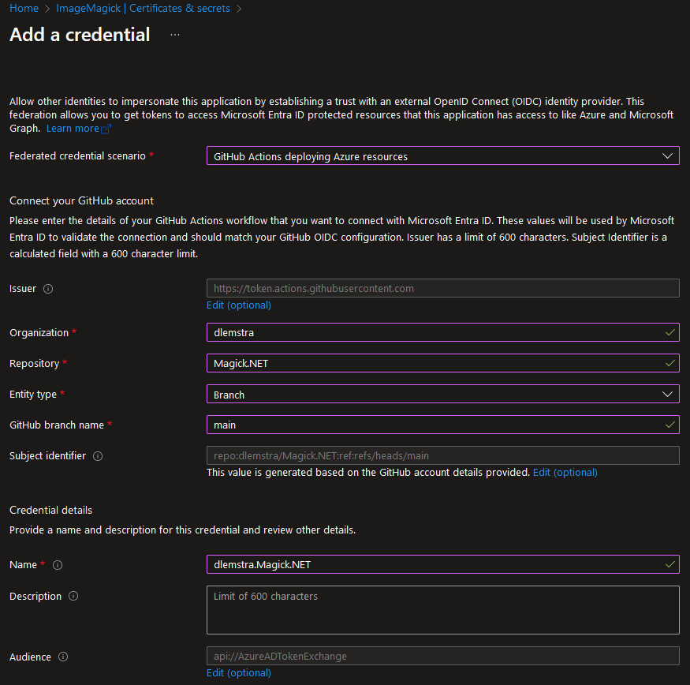
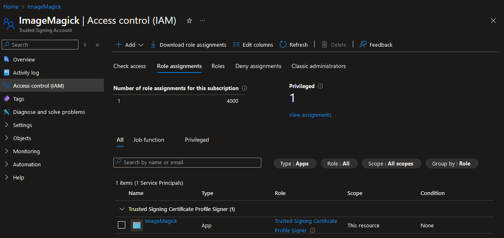
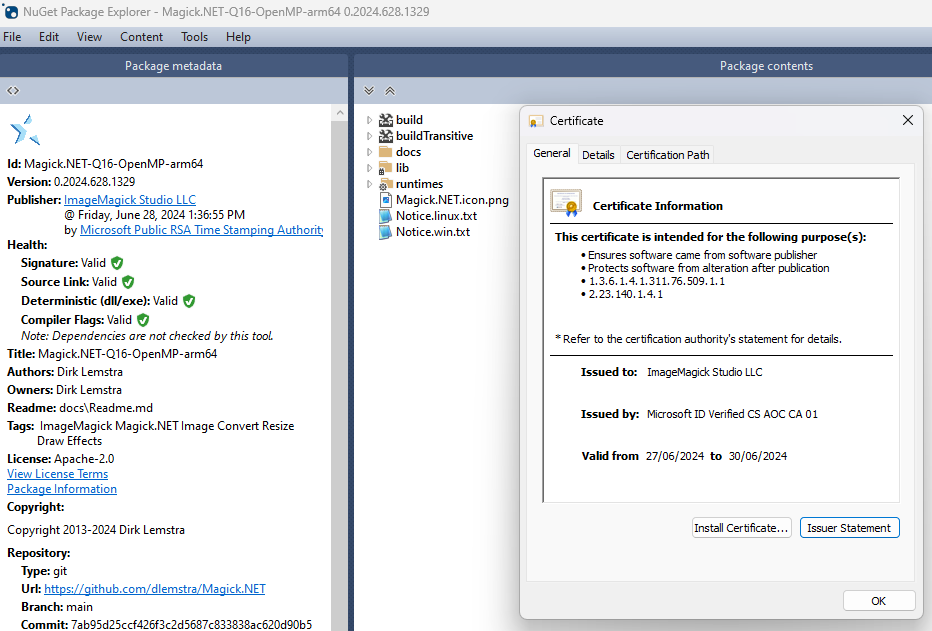

# Signing NuGet packages with Trusted Signing

 A couple of months ago we started signing the libraries and installer of ImageMagick with a Trusted Signing certificate. You can read more about this in the following story: [ImageMagick MSIX installer now uses Trusted Signing](2024/imagemagick-msix-installer-now-uses-trusted-signing). And then I also switched to signing the libraries of [Magick.NET](https://github.com/dlemstra/Magick.NET) with Trusted Signing. But I was unable to sign the NuGet packages because there was no application available that had support for this. But now there is an application available that allows you to sign NuGet packages with Trusted Signing. And in this story I will explain how support for this was added to that application and how you can use it.

# Searching for a tool to sign NuGet packages with Trusted Signing

 After searching for a while I found the issue [Support for Azure Trusted Signing](https://github.com/dotnet/sign/issues/683) in the [dotnet/sign](https://github.com/dotnet/sign) repository. In this issue the author mentioned that they would like to have support for [Trusted Signing](https://learn.microsoft.com/en-us/azure/trusted-signing/) because this was now in public preview. And I was very interested in this because I also wanted to sign the NuGet packages of Magick.NET with Trusted Signing. So I decided to reach out to the team of Trusted Signing to ask if I could help with this. And it turned out that I could help them with this.

# How was support for Trusted Signing added to dotnet/sign?

The dotnet sign cli already had support for signing with a certificate inside an Azure Key Vault. This is done by creating a hash of the file that needs to be signed and then sending this hash to the Azure Key Vault. The Azure Key Vault will then sign the hash with the private key of the certificate and return the signature. And this signature is then added to the file. Trusted Signing works in a similar way. The application also contained support for signing with a certificate from a local certificate store. That code contained some duplication so I first started by refactoring the code to remove some of this duplication and I also changed how the code was structured. This made it much easier to add support for Trusted Signing. Once all that work was done I created the following pull request: [Added support for Trusted Signing](https://github.com/dotnet/sign/pull/716). This has now been merged and it is included in the latest prelease of the dotnet sign cli on [NuGet](https://www.nuget.org/packages/sign).

# Using dotnet/sign in a GitHub action pipeline

There is not yet an official release of the dotnet sign cli but you can already use it in a GitHub action pipeline. The following example shows how you can use it in a GitHub actions pipeline:


```yaml
permissions:
  id-token: write # This is required for the federated credential to work

steps:
- name: Install dotnet sign
  run: dotnet tool install --global sign --prerelease

- name: Azure CLI login with federated credential
  if: github.event_name != 'pull_request'
  uses: azure/login@v2
  with:
    client-id: ${{ secrets.AZURE_CLIENT_ID }}
    tenant-id: ${{ secrets.AZURE_TENANT_ID }}
    subscription-id: ${{ secrets.AZURE_SUBSCRIPTION_ID }}

- name: Sign NuGet package
  if: ${{ github.event_name != 'pull_request' }}
  run: sign code trusted-signing *.nupkg `
    --trusted-signing-account ImageMagick `
    --trusted-signing-certificate-profile ImageMagick `
    --trusted-signing-endpoint https://eus.codesigning.azure.net `
    --verbosity information 
  working-directory: folder-with-nuget-packages

- name: Upload library
  uses: actions/upload-artifact@v4
  with:
    name: nuget-packages
    path: folder-with-nuget-packages
```


The installation of dotnet sign now requires `--prerelease` but once there is an official release you can remove that part. The `--trusted-signing-account` option is the name of the Trusted Signing Account in the Azure portal. The value for the `--trusted-signing-endpoint` option can be found in the overview of the Trusted Signing Account.



The value for the `--trusted-signing-certificate-profile` option can be found in the `Certificate profiles` of the Trusted Signing Account. The name of that profile should be used for the value.



The dotnet sign cli uses [`DefaultAzureCredential`](https://learn.microsoft.com/en-us/dotnet/api/azure.identity.defaultazurecredential?view=azure-dotnet) for authentication when calling the Azure api. And with the help of [`azure/login`](https://github.com/Azure/login) we can create the federated credential to authenticate with Azure. The advantage of a federated credential is that you no longer need to store a token or secret in the secrets of your GitHub repository. This is a much more secure way to authenticate with Azure.

# Setting up the Federated Credential in the Azure Portal

The first step is to create add an App registrations in the Azure portal. This can be done in the Microsoft Entra ID environment:



The next step is adding a federated credential to the App registration.



And for my repository I am using the settings as shown in the image below. With these settings the `azure/login` action will be able to login with the federated credential. This will only work for a commit in the `main` branch and that is why I added the condition `if: ${{ github.event_name != 'pull_request' }}` to the `azure/login` action in my GitHub actions pipeline.



The last step is making sure that this App Registration is allowed to use the Trusted Signing Account. This can be done in the `Access control (IAM)` of the Trusted Signing Account. In the image below you can see that I have added the `Trusted Signing Certificate Profile Signer` role to the App Registration.



# Which files are signed in the NuGet package?

Below is the output of signing a NuGet package with the dotnet sign cli. As you can see below not just the NuGet package is signed but also the files that are included in the NuGet package that can be signed are also signed. This is a nice feature because we then don't need an extra step in the pipeline to sign the `.dll` files before putting them inside the NuGet package.

```
info: Sign.Core.ISigner[0]
      Submitting D:\a\Magick.NET\Magick.NET\publish\output\Magick.NET-Q8-OpenMP-arm64.0.2024.628.1329.nupkg for signing.
info: Sign.Core.ISigner[0]
      SignAsync called for D:\a\Magick.NET\Magick.NET\publish\output\Magick.NET-Q8-OpenMP-arm64.0.2024.628.1329.nupkg. Using C:\Users\runneradmin\AppData\Local\Temp\jewmxlvg.h4z\lbpjdoqc.nupkg locally.
info: Sign.Core.IContainerProvider[0]
      Extracting container C:\Users\runneradmin\AppData\Local\Temp\jewmxlvg.h4z\lbpjdoqc.nupkg to C:\Users\runneradmin\AppData\Local\Temp\byg21k1d.1px.
info: Sign.Core.IDataFormatSigner[0]
      Signing SignTool job with 4 files.
info: Sign.Core.IDataFormatSigner[0]
      Signing C:\Users\runneradmin\AppData\Local\Temp\byg21k1d.1px\runtimes\win-arm64\native\Magick.Native-Q8-OpenMP-arm64.dll.
info: Sign.Core.IDataFormatSigner[0]
      Signing C:\Users\runneradmin\AppData\Local\Temp\byg21k1d.1px\runtimes\win-arm64\native\vcomp140.dll.
info: Sign.Core.IDataFormatSigner[0]
      Signing C:\Users\runneradmin\AppData\Local\Temp\byg21k1d.1px\lib\netstandard20\Magick.NET-Q8-OpenMP-arm64.dll.
info: Sign.Core.IDataFormatSigner[0]
      Signing C:\Users\runneradmin\AppData\Local\Temp\byg21k1d.1px\lib\netstandard21\Magick.NET-Q8-OpenMP-arm64.dll.
info: Sign.Core.IDataFormatSigner[0]
      Signing C:\Users\runneradmin\AppData\Local\Temp\byg21k1d.1px\lib\netstandard20\Magick.NET-Q8-OpenMP-arm64.dll succeeded.
info: Sign.Core.IDataFormatSigner[0]
      Signing C:\Users\runneradmin\AppData\Local\Temp\byg21k1d.1px\runtimes\win-arm64\native\Magick.Native-Q8-OpenMP-arm64.dll succeeded.
info: Sign.Core.IDataFormatSigner[0]
      Signing C:\Users\runneradmin\AppData\Local\Temp\byg21k1d.1px\runtimes\win-arm64\native\vcomp140.dll succeeded.
info: Sign.Core.IDataFormatSigner[0]
      Signing C:\Users\runneradmin\AppData\Local\Temp\byg21k1d.1px\lib\netstandard21\Magick.NET-Q8-OpenMP-arm64.dll succeeded.
info: Sign.Core.IContainerProvider[0]
      Rebuilding container C:\Users\runneradmin\AppData\Local\Temp\jewmxlvg.h4z\lbpjdoqc.nupkg from C:\Users\runneradmin\AppData\Local\Temp\byg21k1d.1px.
info: Sign.Core.INuGetSignTool[0]
      Signing C:\Users\runneradmin\AppData\Local\Temp\jewmxlvg.h4z\lbpjdoqc.nupkg.
info: Sign.Core.INuGetSignTool[0]
      SignAsync [C:\Users\runneradmin\AppData\Local\Temp\jewmxlvg.h4z\lbpjdoqc.nupkg]: Begin Signing lbpjdoqc.nupkg
info: Sign.Core.INuGetSignTool[0]
      NuGet [C:\Users\runneradmin\AppData\Local\Temp\jewmxlvg.h4z\lbpjdoqc.nupkg]: CreatePrimarySignatureAsync: Creating Primary signature
info: Sign.Core.INuGetSignTool[0]
      NuGet [C:\Users\runneradmin\AppData\Local\Temp\jewmxlvg.h4z\lbpjdoqc.nupkg]: CreatePrimarySignatureAsync: Primary signature completed
info: Sign.Core.INuGetSignTool[0]
      NuGet [C:\Users\runneradmin\AppData\Local\Temp\jewmxlvg.h4z\lbpjdoqc.nupkg]: CreatePrimarySignatureAsync: Timestamp primary signature
info: Sign.Core.INuGetSignTool[0]
      NuGet [C:\Users\runneradmin\AppData\Local\Temp\jewmxlvg.h4z\lbpjdoqc.nupkg]: CreatePrimarySignatureAsync: Timestamp completed
info: Sign.Core.INuGetSignTool[0]
      SignAsync [C:\Users\runneradmin\AppData\Local\Temp\jewmxlvg.h4z\lbpjdoqc.nupkg]: End Signing lbpjdoqc.nupkg
info: Sign.Core.IDataFormatSigner[0]
      Signing C:\Users\runneradmin\AppData\Local\Temp\jewmxlvg.h4z\lbpjdoqc.nupkg succeeded.
info: Sign.Core.ISigner[0]
      Completed in 6866 ms.
```

And that resulted in the following signature:



</[@dlemstra](https://github.com/dlemstra)>