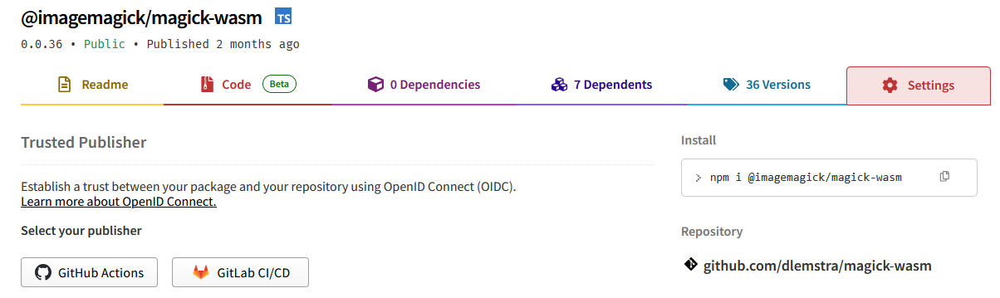
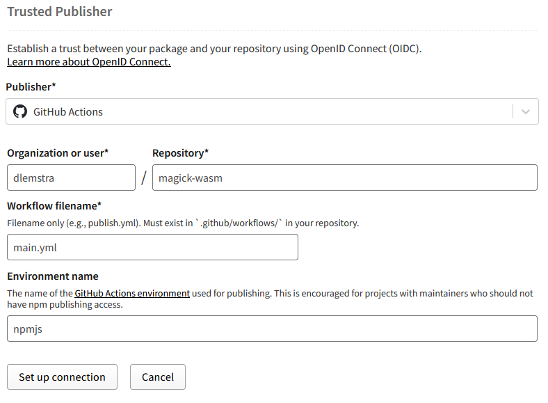
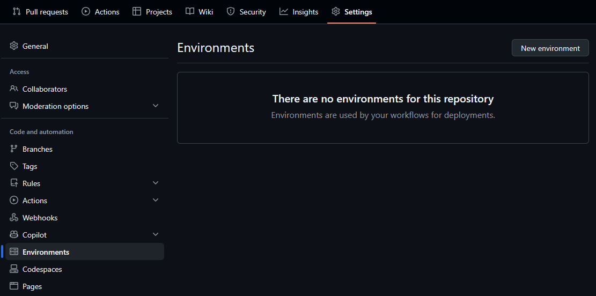
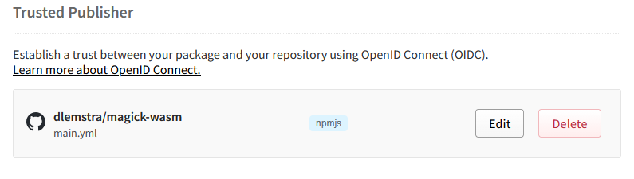
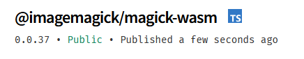

# The magick-wasm npm package now uses Trusted Publisher

Starting with version 0.0.37 of the `@imagemagick/magick-wasm` npm package it is now published automatically by using the new Trusted Publisher feature. Trusted Publisher builds a trust between a repository and the npm registry so that publishing packages no longer requires a PAT token to be stored in the repository secrets.

### The security risks of PAT tokens

PAT (Personal Access Token) tokens pose significant security risks when used in automated publishing workflows. These tokens typically have broad permissions and if they are leaked through workflow logs, accidentally committed to the repository, or exposed through a security breach, an attacker could use them to publish malicious versions of your package. This is especially concerning for packages with many installations because a compromised package could affect thousands or millions of users. Even with careful token rotation, there is always a window of vulnerability when the token is active. And storing tokens in repository secrets, while better than hardcoding them, still means the token exists and could potentially be accessed by anyone with write access to the repository settings.

This was one of the main reasons why I did not publish the `@imagemagick/magick-wasm` package automatically before. I used to publish the package manually by running the `npm publish` command on my local machine and rotating the token before and after each publish. This manual process was time-consuming and error-prone, but it kept the token out of the repository entirely. But now with Trusted Publisher this is no longer necessary because it eliminates the need for tokens altogether.

### Setting up Trusted Publisher in npmjs

Adding a trusted publisher can be done in the settings of your package on npmjs. You can find the settings by going to your package page and clicking on the "Settings" tab.



As you can see in the screenshot above there is a section called "Trusted Publishers". Here you can add a new trusted publisher by clicking on one of the two buttons. You can either add a GitHub repository or a GitLab repository as a trusted publisher. Because all my code is hosted on GitHub I clicked on the "GitHub Actions" button and that will show the following form:



The required fields are the organization, repository and workflow file name. The organization is the GitHub organization or user name where the repository is located. The repository is the name of the repository and the workflow file name is the name of the GitHub Actions workflow file that will be used to publish the package. In my case the organization is `dlemstra`, the repository is `magick-wasm` and the workflow file name is `main.yml`. This workflow file is located in the `.github/workflows` folder of the repository. But as you can see there is also an optional field called "Environment Name" and that allows you to specify a GitHub environment that will be used to publish the package. This environment can be used to add additional security measures so at this point I moved to Github to create an environment for the publishing of the package.

### Setting up an environment in GitHub

The environment can be created in the repository settings. You can find the settings by going to your repository page and clicking on the "Settings" tab. Then click on the "Environments" tab in the left menu. Here you can create a new environment by clicking on the "New environment" button.



Then you will go the the form where you can only enter the name of the environment. I named my environment `npmjs` because it is used to publish the package to npmjs.


And that will finally take you to the environment settings page where you can add protection rules. Here you can add required reviewers, wait timers and deployment branches.


Here I only added the deployment branch rule so that only the `main` branch can be used to publish the package. Because I am the only one working on this repository I did not add any extra protection rules. But if you are working in a team you might want to add required reviewers so that someone else has to approve the publishing before it can be done.

### Finalizing the Trusted Publisher setup

After creating the environment I went back to the npmjs Trusted Publisher form and pressed the "Set up connection" button. And that redirected me back to the settings page where I could see that the trusted publisher was added successfully.



With everything set up it was now time to update the GitHub Actions workflow.

### Setting up the GitHub Actions workflow

The workflow used to create the package and upload it as an artifact that I could download and publish manually on my local machine. This was the start of the workflow:

```yml
on:
  push:
    branches:
      - main
  pull_request:
    branches:
      - main

name: main
permissions:
  contents: read
  packages: read

jobs:
  test: # Test package on different Node.js versions
```

This was the initial part of the workflow that triggered on pushes and pull requests to the `main` branch. The permissions were also set to only read the contents and packages because no publishing was done in this workflow. It would only create the package and upload it as an artifact. To add the publishing step I had to make some changes to the workflow and added two new jobs. That started with adding a new job to check if the package should be published:

```yml
jobs:
  check:
    if: github.event_name == 'push' && github.ref == 'refs/heads/main'
    name: Check for publish
    runs-on: ubuntu-24.04
    outputs:
      publish: ${{steps.check.outputs.publish}}

    steps:
      - uses: actions/checkout@v5
        with:
          fetch-depth: 0

      - name: Check publish
        id: check
        run: |
          version=$(grep -oP "\"version\": \"\K[0-9\.]*" package.json)
          echo "version=$version"
          tag=$(git describe --tags HEAD --exact-match || true)
          if [[ "$tag" == "$version" ]]; then
            echo "publish=true" >> $GITHUB_OUTPUT
            echo "publish=true"
          fi
```

The `check` jobs checks if the current commit is tagged with a version that matches the version in the `package.json` file. If it does it will set the `publish` output to `true`. This will be used in the `publish` job to determine if the package should be published or if a dry-run should be done.

```yml
  publish:
    name: Publish package
    needs:
      - test
      - check
    runs-on: ubuntu-24.04
    environment: npmjs
    permissions:
      contents: read
      packages: read
      id-token: write

    steps:
      - name: Use node 24
        uses: actions/setup-node@v6
        with:
          node-version: 24

      - name: Authenticate with GitHub package registry
        run: echo "//npm.pkg.github.com/:_authToken=${{secrets.GITHUB_TOKEN}}" >> ~/.npmrc

      - uses: actions/checkout@v5

      - run: npm ci

      - run: npm run build

      - if: needs.check.outputs.publish != 'true'
        name: Run npm publish --dry-run
        run: |
          set +e
          output=$(npm publish --registry https://registry.npmjs.org/ --dry-run 2>&1)
          exit_code=$?
          echo "$output"
          if [ $exit_code -ne 0 ] && echo "$output" | grep -q "You cannot publish over the previously published versions:"; then
            echo "Version already published, continuing..."
            exit 0
          fi
          exit $exit_code

      - if: needs.check.outputs.publish == 'true'
        name: Run npm publish
        run: npm publish --registry https://registry.npmjs.org/
```

In the `publish` job you can see that the `environment` is set to `npmjs` which is the environment we created earlier. This will ensure that the publishing can only be done from the `main` branch. The rest of the job is pretty standard. It sets up Node.js, checks out the code, installs the dependencies, builds the package and finally publishes it to npmjs if the `publish` output from the `check` job is `true`. 

If the `publish` output is not `true`, a dry-run is performed instead to verify that the package builds correctly. The dry-run includes special error handling because after publishing a release, the version in `package.json` remains unchanged until the next release cycle. This means that subsequent pushes to main will trigger the workflow and attempt a dry-run with a version that has already been published to npmjs. Without the error handling, this would cause the workflow to fail even though nothing is actually wrong. The script checks if the dry-run failure is specifically due to the version already being published, and if so, treats it as a success and continues without failing the workflow. This keeps CI green for regular development work between releases.

Now you might be wondering why there is no step to authenticate with npmjs. That is because the Trusted Publisher feature takes care of that for us. To enable that the `id-token` permission is set to `write` in the `publish` job. This will allow the workflow to request an OpenID Connect (OIDC) token that can be used to authenticate with npmjs without the need for a PAT token. And now with everything set up it was time to create a new release and see if the publishing worked as expected.

### Publishing the package using the workflow

Before publish a new version of the package I had to bump the version in the `package.json` file and create a new tag that matches the version. After pushing the changes to the `main` branch the workflow started automatically and after a few minutes the package was published successfully:



And this was the output of the `npm publish` command in the workflow:

```
Run npm publish --registry https://registry.npmjs.org/
> @imagemagick/magick-wasm@0.0.37 prepare
> node npm-postinstall.mjs
Copied node_modules/@dlemstra/magick-native/NOTICE to NOTICE
Copied node_modules/@dlemstra/magick-native/magick.wasm to dist/magick.wasm
npm notice
npm notice 📦  @imagemagick/magick-wasm@0.0.37
npm notice Tarball Contents
npm notice 11.4kB LICENSE
npm notice 208.2kB NOTICE
npm notice 2.1kB README.md
npm notice 113.6kB dist/index.d.ts
npm notice 363.0kB dist/index.js
npm notice 218.4kB dist/index.umd.cjs
npm notice 14.5MB dist/magick.wasm
npm notice 2.0kB package.json
npm notice Tarball Details
npm notice name: @imagemagick/magick-wasm
npm notice version: 0.0.37
npm notice filename: imagemagick-magick-wasm-0.0.37.tgz
npm notice package size: 5.4 MB
npm notice unpacked size: 15.4 MB
npm notice shasum: 17b38178452d76284676253831b61a740c66556c
npm notice integrity: sha512-tVs9hcWu9u7I3[...]f2RGT9+1l3nxQ==
npm notice total files: 8
npm notice
npm notice Publishing to https://registry.npmjs.org/ with tag latest and default access
npm notice publish Signed provenance statement with source and build information from GitHub Actions
npm notice publish Provenance statement published to transparency log: https://search.sigstore.dev/?logIndex=660669340
+ @imagemagick/magick-wasm@0.0.37
```

As you can see the package was published successfully and a signed provenance statement was also published. This statement contains information about the source and build of the package and allows anyone to verify the authenticity of the package and ensures that it was built from the source code in the repository.

With Trusted Publisher now in place, the publishing process for the `@imagemagick/magick-wasm` package is more secure, fully automated, and no longer requires any manual token management. The combination of OIDC-based authentication and GitHub environment protection rules provides multiple layers of security that were not possible with PAT tokens. Every published package now includes a signed provenance statement that can be verified by anyone, adding transparency and trust to the supply chain. This setup eliminates the risk of token leakage while making releases more reliable and consistent. If you maintain an npm package and haven't yet migrated to Trusted Publisher, I highly recommend making the switch to improve both the security and maintainability of your publishing workflow.

</[@dlemstra](https://github.com/dlemstra)>
