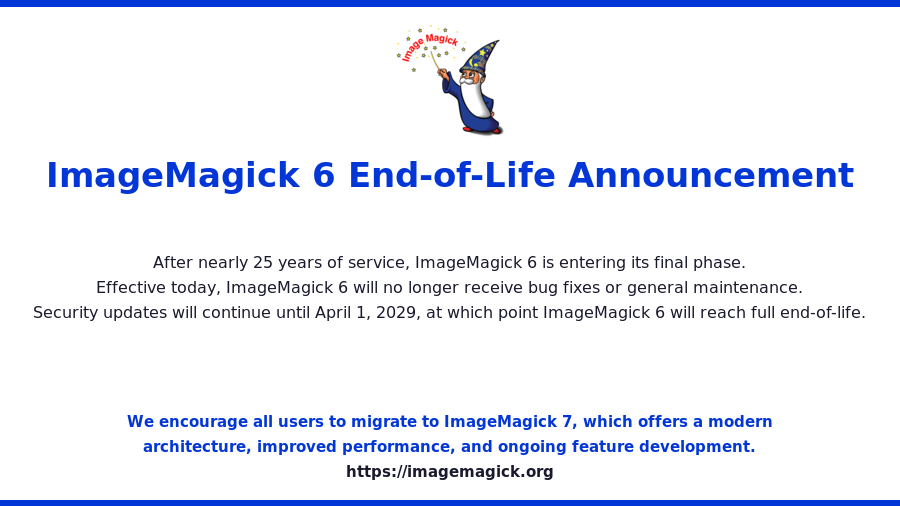

<div align="center"></div>

<br>

After more than three decades of continuous innovation, [ImageMagick](https://imagemagick.org) continues to evolve, and today marks an important milestone in that journey.

ImageMagick was first released in 1990, and since then it has grown into one of the most widely used and trusted open‑source image processing libraries in the world. In 2004, we introduced [ImageMagick 6](https://legacy.imagemagick.org), a major update that became the foundation for countless applications, research projects, and production systems. For many years, it served as the primary version of ImageMagick and helped define modern image processing workflows.

In 2016, we launched ImageMagick 7, a significant redesign focused on performance, consistency, and long‑term maintainability. Since then, we have maintained both versions in parallel to give users time to transition at their own pace. Over the past several years, we have encouraged the community to adopt ImageMagick 7, which is now the recommended and actively developed version.

The time has come to bring ImageMagick 6 to a close.

Effective today, ImageMagick 6 will no longer receive bug fixes or general maintenance updates. While new features have not been added to ImageMagick 6 for quite some time, we have continued to provide stability improvements; and that chapter now ends. To ensure a responsible and secure transition period, we will continue to provide security updates for ImageMagick 6 until **April 1, 2029**. That date will mark **25 years of support**, an extraordinary lifespan for a major software version.

After April 1, 2029, ImageMagick 6 will reach its final end‑of‑life and will no longer be supported in any capacity. The Github repository will be archived. It will be read-only and will no longer accept issues or pull requests.

We strongly encourage all users, developers, and downstream projects to migrate to ImageMagick 7 as soon as possible. ImageMagick 7 offers a more modern architecture, improved performance, a unified command‑line interface, and ongoing feature development. All future innovation in ImageMagick will continue exclusively in version 7 and beyond.

Thank you to everyone who has contributed to, maintained, or relied on ImageMagick 6 over the years. Its longevity is a testament to the strength of the community and the importance of open‑source collaboration.

<br>


```bash
# I made billions of images, and I had to make my own going away poster
convert \
  -size 900x506 xc:white \
  \( logo: -resize 150x150 \) \
  -gravity North -geometry +0+25 -composite \
  -fill '#0336d6' -draw "rectangle 0,0 900,6" \
  -fill '#0336d6' -draw "rectangle 0,500 900,506" \
  -font DejaVu-Sans-Bold -pointsize 34 \
  -fill '#0336d6' -gravity North -annotate +0+155 "ImageMagick 6 End-of-Life Announcement" \
  -font DejaVu-Sans -pointsize 16 \
  -fill '#1a1a2e' -gravity Center -annotate +0+10 "After nearly 25 years of service, ImageMagick 6 is entering its final phase." \
  -fill '#1a1a2e' -gravity Center -annotate +0+35 "Effective today, ImageMagick 6 will no longer receive bug fixes or general maintenance." \
  -fill '#1a1a2e' -gravity Center -annotate +0+60 "Security updates will continue until April 1, 2029, at which point ImageMagick 6 will reach full end-of-life." \
  -font DejaVu-Sans-Bold -pointsize 15 \
  -fill '#0336d6' -gravity South -annotate +0+75 "We encourage all users to migrate to ImageMagick 7, which offers a modern" \
  -fill '#0336d6' -gravity South -annotate +0+50 "architecture, improved performance, and ongoing feature development." \
  -fill '#1a1a2e' -gravity South -annotate +0+25 "https://imagemagick.org" \
  images/imagemagick6-eol.png
```

