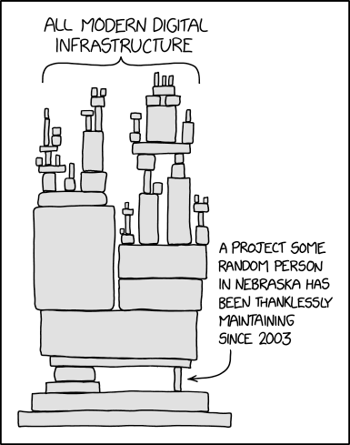

# ImageMagick was part of the GitHub Secure Open Source Fund

In September of 2025, ImageMagick became part of the GitHub Secure Open Source Fund, a program that provides financial support to open source projects that are critical to the security of the software supply chain. The fund is designed to help maintainers of open source projects that are widely used and have a significant impact on the security of the software ecosystem. In this story I will share the key takeaways for ImageMagick and the impact of being part of the GitHub Secure Open Source Fund.

# How did we get selected?

Most of you have probably seen this [XKCD image](https://xkcd.com/2347/) before. But not many people have probably read the alt text of the image:

> Someday ImageMagick will finally break for good and we'll have a long period of scrambling as we try to reassemble civilization from the rubble.

So it was probably fair that we were finally selected in this third round of the GitHub Secure Open Source Fund. But how did we get selected? The selection process is not shared and to be honest I am happy about that. Otherwise people would probably try to game the system to get selected. So I have no clue why we were selected but I am very happy that we were selected.

# The training

As part of the GitHub Secure Open Source Fund, we had to complete a training program. This training program was designed to help us improve the security of our project. The training program consisted of online virtual sessions and workshops that covered various topics related to open source security. The training was very informative and provided us with valuable insights on how to improve the security of our project. And the good part was that we got compensated (funded) for the time we spent on the training. So it was a win-win situation for us.

## The core 5 activations

Part of the training program was to activate 5 security features in our GitHub repository. These features are designed to help us improve the security of our project. Almost every project that was selected had to activate these 5 features and the good news is that every project was able to do that. In this section I will explain them briefly and share the impact they had on our project.

### <a href="https://docs.github.com/en/code-security/how-tos/secure-your-secrets/detect-secret-leaks/enabling-secret-scanning-for-your-repository" target="_blank" rel="noopener noreferrer">Activate secret scanning</a>

Secret scanning is a GitHub security feature that automatically detects and helps prevent the accidental exposure of sensitive information like API keys, passwords, tokens, and other credentials in your repositories. We had already activated secret scanning when it became available so this was not new for us.

### <a href="https://docs.github.com/en/code-security/how-tos/scan-code-for-vulnerabilities/configure-code-scanning" target="_blank" rel="noopener noreferrer">Activate code scanning</a>

Code scanning is a GitHub feature that automatically analyzes your code to find security vulnerabilities and coding errors. It helps you identify and fix potential issues before they are released. We already had a CodeQL workflow set up for our repository that is executed every day. But we did tweak some of the settings to make sure we are getting the most out of it. And one of the trainings showed us how we could create our own custom queries. We have not done that yet but that might be something we will explore in the future.

### <a href="https://docs.github.com/en/repositories/configuring-branches-and-merges-in-your-repository/managing-protected-branches/managing-a-branch-protection-rule" target="_blank" rel="noopener noreferrer">Activate protected branches</a>

Protected branches are a GitHub feature that allows you to set rules to protect important branches in your repository (like main or production). They help enforce specific workflows and requirements before changes can be pushed or merged. In our projects we had enabled classic branch protection rules for the main branch but because of the training we switched to the new branch protection rules. This provides some extra options that we might use in the future.

### <a href="https://docs.github.com/en/code-security/how-tos/report-and-fix-vulnerabilities/configure-vulnerability-reporting/configuring-private-vulnerability-reporting-for-a-repository" target="_blank" rel="noopener noreferrer">Activate private vulnerability reporting</a>

Private vulnerability reporting is a GitHub feature that enables security researchers to report security vulnerabilities directly and privately to repository maintainers through a secure, structured process. This was also something that we had already enabled but during the training we did learn some valuable tips on how to handle vulnerability reports and how to communicate with security researchers.

### <a href="https://docs.github.com/en/code-security/tutorials/secure-your-dependencies/dependabot-quickstart-guide" target="_blank" rel="noopener noreferrer">Activate Dependabot</a>

The last activation was to activate Dependabot. Dependabot is a GitHub tool that helps you keep your project dependencies secure and up-to-date automatically. It monitors your repository's dependencies and takes action to maintain your supply chain security. Because we have a C project and don't use any of the supported package managers we only activated updates for GitHub Actions. But we did learn about an option in the settings of Dependabot called 'cooldown'. This option allows you to set a cooldown period for Dependabot alerts, that would prevent Dependabot from directly creating a pull request when a dependency is updated. This would give us some time in case a dependency gets compromised. This is of course not a perfect solution but it is better than nothing.

## The other 4 activations

So for the core 5 activations we were already doing most of them. But there were also 4 other activations that we had to do as part of the training program. These are also important and we also managed to activate all of them.

### <a href="https://docs.github.com/en/code-security/how-tos/report-and-fix-vulnerabilities/configure-vulnerability-reporting/adding-a-security-policy-to-your-repository" target="_blank" rel="noopener noreferrer">Setup SECURITY.md</a>

A SECURITY.md file is a standardized file in a GitHub repository that provides security-related information and guidelines for the project. Ours contained a small explanation of how to report a security vulnerability and a link to our private vulnerability reporting form. We had one in our primary repository but also created one in our other repositories. But to make sure we had the same version in all repositories we added a `SECURITY.md` file to our https://github.com/ImageMagick/.github repository and that now shows up in all our repositories on the security tab.

### <a href="https://github.com/resources/articles/what-is-incident-response#creating-an-incident-response-plan" target="_blank" rel="noopener noreferrer">Establish incident response plan</a>

An incident response plan is a documented, organized approach for detecting, responding to, and recovering from security incidents or other critical disruptions to your systems, applications, or services. In this case the focus was on responding to security incidents related to our open source project. This was something that we had not yet done. There are multiple ways to do this but we decided to document this in the `SECURITY.md` file in our `.github` repository. This now contains a diagram that shows the process we will follow when we receive a security vulnerability report. This was created with [Mermaid](https://mermaid.js.org/) and they were also part of the training. You can view the result here: https://github.com/ImageMagick/.github/blob/main/SECURITY.md.

### <a href="https://docs.github.com/en/authentication/securing-your-account-with-two-factor-authentication-2fa/configuring-two-factor-authentication" target="_blank" rel="noopener noreferrer">Activate MFA for all maintainers and major contributors</a>

Another activation was to activate MFA for all maintainers and major contributors. This is a security measure that requires users to provide multiple verification factors to gain access to their accounts, adding an extra layer of security beyond just a password. Turning this on was quite simple for us because we have a very small team of maintainers and major contributors and they already had MFA enabled on their accounts.

### <a href="https://wellarchitected.github.com/library/application-security/recommendations/threat-model/" target="_blank" rel="noopener noreferrer">Outline threat model</a>

This was the last activation and it was also the last thing that we did. A threat model is a structured representation of potential security threats and vulnerabilities that could affect a system, application, or project. For us this was primarily focused on non-code related threats. And also more an inventory of potential threats instead of a detailed model. This document is kept private but I have seen other projects that have shared their threat model publicly. One threat that was part of the training was the security of GitHub Actions workflows. Ours were already pretty secure but we trimmed down the permissions even more. A great tool that can be used for this is [zizmor](https://github.com/zizmorcore/zizmor). This will statically analyze your GitHub Actions workflows and point out potential security issues.

# What else did we learn and do?

One of the great things about the training program was that we had the opportunity to learn from other projects that were part of the program. We had a slack channel where we could ask questions and share our experiences. We learned a lot from other projects and we also shared some of our experiences.

Another thing that we enabled was immutable releases but I will share more about that in a future story.

After the GitHub Actions security training I decided to do a security review of some other projects on GitHub. This allowed me to learn a lot about the security of GitHub Actions workflows and also to find some vulnerabilities in other projects. I will share some of these vulnerabilities in future stories. One story has already been published and you can read it here: [The danger of comments in pull requests](https://github-stories.com/2025/the-danger-of-comments-in-pull-requests/).

# Conclusion

Being part of the GitHub Secure Open Source Fund was a great experience for us. We learned a lot from the training program and we were able to improve the security of our project. We also had the opportunity to learn from other projects and share our experiences. We are very grateful to GitHub for selecting us and providing us with this opportunity. We hope that we can continue to improve the security of our project and contribute to the security of the software ecosystem. If you want to be part of the next round of the GitHub Secure Open Source Fund, you can apply [here](https://github.com/open-source/github-secure-open-source-fund).

</[@dlemstra](https://github.com/dlemstra)>
