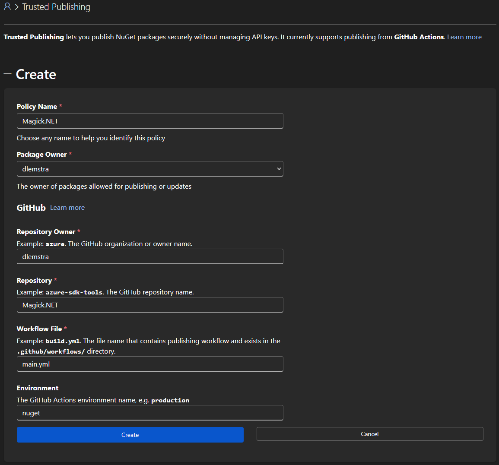

# Magick.NET now uses NuGet Trusted Publishing together with Artifact Signing

NuGet recently announced Trusted Publishing that makes it possible to publish NuGet packages in a GitHub Actions workflow without the need of configuring an API key as a secret. I wanted to make use of this new feature with the Magick.NET libraries. This uses Artifact Signing to sign the packages before they are published to NuGet. But because the certificate that is used for Artifact Signing is short-lived and rotated frequently I had to solve some challenges to make this work in an automated way. In this story I will explain how I did that.

## What are the challenges?

In 2024 I started using Trusted Signing to sign the libraries of Magick.NET before a release is published to NuGet. You can read more about that in my story [Signing NuGet packages with Trusted Signing](../../2024/signing-nuget-packages-with-trusted-signing). This is now available for everyone as announced [here](https://techcommunity.microsoft.com/blog/microsoft-security-blog/simplifying-code-signing-for-windows-apps-artifact-signing-ga/4482789) under the new name Artifact Signing. It signs binaries and packages with a certificate that has a short-lived key that is rotated every 3 days. This improves security and reduces the risk of key compromise. But that also means each time you publish a NuGet package you will need to upload a new certificate file to NuGet. This is only possible through the NuGet website and not through the NuGet API. This makes it impossible to fully automate the publishing of NuGet packages in a GitHub Actions workflow. But I wanted to find a way to work around this limitation.

## Configuring NuGet for Trusted Publishing

The configuration of NuGet is done through the NuGet website. In the menu of the NuGet website you can find the option "Trusted Publishing". Here you can configure the information that is needed to publish packages through Trusted Publishing. You will need to enter the following information when configuring this:



As you can see the configuration is pretty straightforward. The only field that needs some explanation is the "Environment" field. This field specifies the GitHub Actions environment that the workflow should use. Using this environment makes it even more secure because you can configure additional protection on the environment.

## Creating a GitHub Actions environment

An environment can be created in the settings of your GitHub repository:


Once this environment is created you can configure extra protection rules on the environment as shown below:


For my project I only added a branch protection rule that only allows the `main` branch to deploy to this environment. This way I make sure that only code that is merged to the `main` branch can publish packages to NuGet. There were more rules that I could have added but for now this was sufficient for my needs.

## Updating the GitHub Actions workflow

I started with updating my GitHub Actions workflow to include a job for publishing the NuGet packages. This job is only executed when a commit is pushed to the `main` branch and it also uses the `nuget` environment that I created in the previous step.


```yaml
jobs:
  publish:
    if: github.event_name == 'push' && github.ref == 'refs/heads/main'
    name: Publish packages to NuGet (tagged releases only)
    runs-on: windows-2022
    environment: nuget

    permissions:
      id-token: write
      contents: read
      packages: read
```


Publishing the NuGet packages with Trusted Publishing requires adding the step below to your GitHub Actions workflow. This step uses the [NuGet/login](https://github.com/NuGet/login) action to authenticate with NuGet without the need of adding a secret with an API key. It only requires the `id-token: write` permission to be set for the job as shown above.


```yaml
- name: NuGet login
  uses: NuGet/login@d22cc5f58ff5b88bf9bd452535b4335137e24544 # v1
  id: login
  with:
    user: dlemstra
```


This action has only one required input and that is your NuGet username. But it also has an id parameter that is needed to reference the output of this action in the next step:


```yaml
- name: Publish NuGet packages
  if: needs.version.outputs.publish == 'true'
  env:
    NUGET_API_KEY: ${{ steps.login.outputs.NUGET_API_KEY }}
  run: ../publish/push.cmd
  working-directory: packages
```


As shown in the example above the API key is retrieved from the output of the previous step and set as an environment variable. And used in the `push.cmd` file:


```cmd
@echo off

if "%NUGET_API_KEY%"=="" (
    echo Error: NUGET_API_KEY environment variable is not set
    exit /b 1
)

echo Waiting 5 minutes before pushing packages...
ping -n 301 127.0.0.1 > nul

for /r %%i in (*.nupkg) do ..\tools\windows\nuget.exe push %%i -ApiKey %NUGET_API_KEY% -Source "https://api.nuget.org/v3/index.json"
```


This script uses the `nuget.exe` executable to push all NuGet packages in the `packages` folder to NuGet. But as you might have noticed there is a delay of 5 minutes before the packages are pushed. And that is part of the workaround that I had to implement to make sure that the certificate is available on NuGet before the packages are pushed.

## Solving the issue with the certificate upload

So why did I add this delay of 5 minutes? The reason for this is to give me some time to manually upload the certificate to NuGet before the packages are pushed. For this I added an extra step to the workflow:


```yaml
- name: Print public key
  run: |
    pip3 install asn1crypto
    python3 ./build/windows/print.publickey.py

- name: NuGet login
```


This runs the following Python script that extracts the public key from the NuGet package and prints it to the console:


```python
from asn1crypto import cms as asn1_cms
import base64
import zipfile
import os

COMMON_NAME = 'ImageMagick Studio LLC'

package = os.path.join('./packages', [file for file in os.listdir('./packages') if file.endswith('.nupkg')][0])

with zipfile.ZipFile(package, 'r') as zip_ref:
    signature_data = zip_ref.read('.signature.p7s')

certificates = asn1_cms.ContentInfo.load(signature_data)['content']['certificates']

for i, cert in enumerate(certificates):
    if cert.chosen['tbs_certificate']['subject'].native['common_name'] == COMMON_NAME:
        cert_b64 = base64.b64encode(cert.dump()).decode()
        print(f"\n-----BEGIN CERTIFICATE-----")
        print('\n'.join([cert_b64[j:j+64] for j in range(0, len(cert_b64), 64)]))
        print(f"-----END CERTIFICATE-----")
```


This script searches for the certificate with the common name `ImageMagick Studio LLC` and prints it to the console in PEM format. NuGet requires certificates to be in DER/CER format instead of PEM format. So I will need to copy the text to a file called `ImageMagick.pem` on my local machine and then convert it to a `.cer` file using the following PowerShell script:


```powershell
$cert = New-Object System.Security.Cryptography.X509Certificates.X509Certificate2("../keys/ImageMagick.pem")

[System.IO.File]::WriteAllBytes("../keys/ImageMagick.cer", $cert.Export([System.Security.Cryptography.X509Certificates.X509ContentType]::Cert))
```


The last step is to upload the `ImageMagick.cer` file to NuGet through the website. Once that is done I can wait for the 5 minutes to be over and the packages will be pushed to NuGet successfully. So this is not a fully automated solution but at least it makes it possible to publish the signed packages through a GitHub Actions workflow with the help of Trusted Publishing and Artifact Signing with minimal manual intervention.

I really hope that NuGet will improve and implement my proposal that got accepted last year: [Improve support for NuGet packages that are signed with a Trusted Signing certificate](https://github.com/NuGet/Home/blob/dev/accepted/2024/improve-support-for-packages-signed-with-trusted-signing.md). This would require uploading the certificate only once and then using the Durable Identity Value (a stable identifier for the signing certificate chain) for subsequent package publishes, eliminating the need for manual certificate uploads with each release.

</[@dlemstra](https://github.com/dlemstra)>
